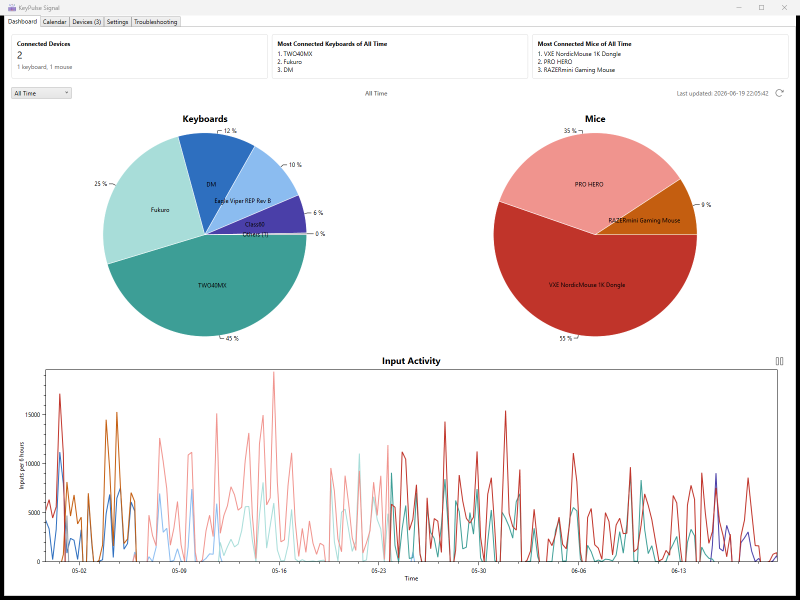
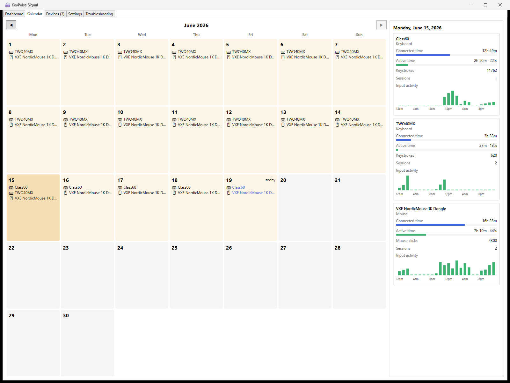

# KeyPulse Signal

**Know exactly which board or mouse you picked up today, and how hard you pushed it.**

KeyPulse Signal is a lightweight Windows desktop app built for keyboard and mouse enthusiasts who frequently rotate gear and want real data behind their daily drivers. It silently tracks every USB connection, counts every keystroke and click per device, and gives you a per-device breakdown by day. You always know which board carried the most load this week, or how long that new endgame actually spent on the desk.



## What It Tracks

- **Connection history**: when each external USB device was plugged in, for how long, and how many sessions.
- **Input activity**: per-device keystrokes, mouse clicks, and movement time captured silently in the background.
- **Daily summaries**: a calendar view showing which devices were active on any given day, with session counts, active time as a share of connected time, and an hour-by-hour activity breakdown that highlights your peak hour.
- **Live device state**: a device list showing what's connected right now, with real-time input counters ticking up as you type, alongside per-device lifetime totals like time connected and days connected.



## Why It's Useful for Collectors

- Rotate through boards freely. KeyPulse logs every connection automatically, with no manual entries.
- Compare daily drivers objectively: "Did I actually use the new build more than the old one this week?"
- Spot usage patterns: see which layouts or switches you gravitate toward by day of week or time of day.
- Keep a persistent history even across reboots, crashes, or hot-swaps.

## Features

- Detects connected USB keyboards and mice at startup, then monitors USB plug/unplug events via WMI.
- Tracks per-device connection duration with crash-recovery-safe lifecycle reconstruction.
- Captures minute-level activity snapshots of `Keystrokes`, `MouseClicks`, and `MouseMovementSeconds`.
- Dashboard with connection summaries, distribution charts, and activity timelines across any date range.
- Calendar view showing per-day and per-device input/connection breakdowns.
- Hide individual devices from the dashboard and calendar while still tracking them in the background.
- Pause and resume input tracking on demand from the dashboard or tray.
- Configurable data retention for per-minute activity detail.
- Troubleshooting log viewer with severity coloring, search/filter, and auto-scroll.
- Runs in the system tray for zero UI clutter while you work.
- Single instance. Activating a second launch restores the existing window.

## Requirements

### Users

- Windows 11 recommended, or Windows 10 version 1607 or later.
- .NET 8 Desktop Runtime for framework-dependent builds.
- One or more external USB keyboards or mice to track. Built-in laptop keyboards/trackpads are not supported.

### Developers

- Windows 10/11
- .NET 8 SDK
- Visual Studio 2022 or JetBrains Rider with WPF support

## Tech Stack

- .NET `net8.0-windows`
- WPF
- Entity Framework Core 9
- SQLite
- Windows WMI via `System.Management`
- Windows Raw Input via `WM_INPUT`
- `Microsoft.Extensions.DependencyInjection`
- Serilog

## Quick Start for Development

```powershell
dotnet restore
dotnet build -c Debug
dotnet run -c Debug
```

Release-mode run:

```powershell
dotnet run -c Release
```

## Configuration

- Default startup mode:
  - `Debug`: foreground window
  - `Release`: tray/background mode
- Default `LaunchOnLogin`:
  - `Debug`: off, which avoids polluting the Windows startup registry during development
  - `Release`: on
- Launch argument override:
  - `--tray` forces tray/background startup for that launch.

## Data Storage

- `Release`: `%AppData%\KeyPulse Signal\keypulse-data.db`
- `Debug`: `%AppData%\KeyPulse Signal\Test\keypulse-data.db`

Main persisted tables:

- `Devices`: mutable device snapshot
- `DeviceEvents`: immutable lifecycle log
- `ActivitySnapshots`: immutable minute buckets
- `DailyDeviceStats`: per-day per-device aggregates

## High-Level Architecture

- `AppTimerService`: shared 1-second, 30-second, and hourly UI-thread timers.
- `UsbMonitorService`: WMI monitoring, event deduplication, connection lifecycle management.
- `RawInputService`: per-device raw input capture and minute-bucket activity aggregation.
- `DataService`: migrations, persistence, crash recovery, snapshot rebuild.
- `DailyStatsService`: computes and maintains per-day per-device stats from lifecycle events and activity snapshots.

## Troubleshooting

- Second launch activates the running instance, which is the expected single-instance behavior.
- If build output is locked, stop the running app before rebuilding.
- If a device shows `Unknown Device`, rename it in-app or check Windows device metadata. This is common for laptop touchpads and other single-interface HID devices.

## Documentation

- `AGENTS.md`: architecture and implementation conventions.
- `docs/PRODUCTION_READINESS_PLAN.md`: production hardening checklist.
- `docs/RELEASE_PROCESS.md`: versioning and release workflow.
- `docs/RELEASE_CHECKLIST.md`: release validation steps.
- `CHANGELOG.md`: release-to-release changes.
